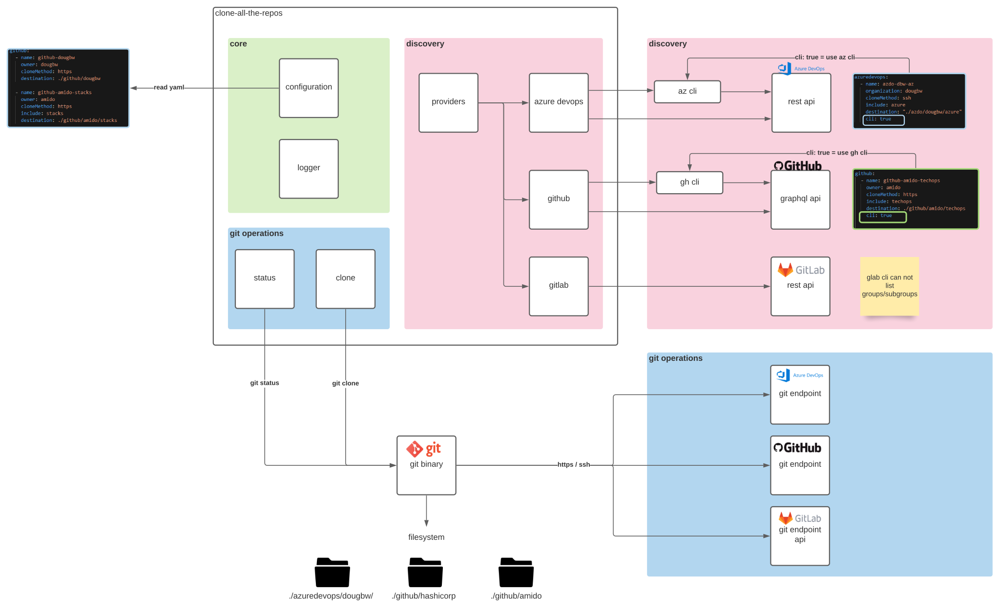

# Introduction

`clone-all-the-repos` is a tool written in go which helps organize git repos on your workstation when cloning from Azure DevOps/GitHub/GitLab. It is configuration driven and uses API/cli tools to discover the remote git repositories, then essentially runs `git clone` in bulk, allowing you to mirror the respective remote system structure regarding organizations, projects, etc.

# Installation

* compile code (use `build.ps1` or `go build cmd/clone-all-the-repos.go`)
* add to path

# Usage

There is only a single argument which is the path to the configuration file to be processed. 

The eventual git clone operations are executed using your systems installed `git`, so it does not handle or manage the git endpoint credentials in any way.

**Example**: 

```
clone-all-the-repos C:\repos\repos.yaml
```

# Requirements

* Remote git repo(s)
* git
* authentication token(s)
* az cli (optional)
* gh cli (optional)

# Providers:

Supported providers are listed in the table below.

| Provider | Discovery Method | Environment Variable | Required Scope |
| --- | --- | --- | --- |
| azuredevops | [Rest API](https://docs.microsoft.com/en-us/rest/api/azure/devops/?view=azure-devops-rest-7.1) | `AZDO_PERSONAL_ACCESS_TOKEN` | `Code (Read)` |
| azuredevops | [az cli](https://docs.microsoft.com/en-us/cli/azure/install-azure-cli) | n/a | n/a |
| github | [GraphQL API](https://docs.github.com/en/graphql) | `GITHUB_TOKEN` | `repo` |
| github | [gh cli](https://github.com/cli/cli) | n/a | n/a |
| gitlab | [Rest API](https://docs.gitlab.com/ee/api/) |  `GITLAB_TOKEN` | `read_api` |


## Azure DevOps

Azure DevOps configuration objects are listed within a `azuredevops` key.


| property | type | required | default |  allowed values | description  |
| --- | --- | --- | --- | --- | --- |
| name | string | **true** | - | - | free form string - used in logs to show what is currently being processed |
| organization | string | **true** | - | - | target azure devops organization |
| cloneMethod | string | **true** | - |`https`<br> `ssh` | which `git clone` method to use |
| include | string | false | - |- | regex filter to only return matching projects/repos |
| exclude | string | false  | - | - | regex filter to hide matching projects/repos |
| destination | string | false  | `./azuredevops/{organization}/{project}` | - | local directory path where repos will be cloned in to, relative to the configuration file |
| cli | bool | false| false | `true` <br> `false` | flag to set whether az cli or the rest api is used for discovey process. <br><br>`true`: The `az` cli must be installed and logged in with `az login`. <br><br>`false`: The `AZDO_PERSONAL_ACCESS_TOKEN` environment variable must be set to a valid [personal access token](https://docs.microsoft.com/en-us/azure/devops/organizations/accounts/use-personal-access-tokens-to-authenticate?view=azure-devops&tabs=preview-page) |

Example configuration:
```
azuredevops:
  - name: my-config-name
    organization: myorg
    cloneMethod: ssh
    destination: ./azdo/myorg
```


## GitHub

GitHub configuration objects are listed within a `github` key


| property | type | required | default |  allowed values | description  |
| --- | --- | --- | --- | --- | --- |
| name | string | **true** | - | - | free form string - used in logs to show what is currently being processed |
| owner | string | **true** | - | - | target azure github owner |
| cloneMethod | string | **true** | - |`https`<br> `ssh` | which `git clone` method to use |
| include | string | false | - |- | regex filter to only return matching projects/repos |
| exclude | string | false  | - | - | regex filter to hide matching projects/repos |
| destination | string | false  | `./github/{owner}/` | - | local directory path where repos will be cloned in to, relative to the configuration file |
| cli | bool | false| false | `true` <br> `false` | `true:` the `gh` cli must be installed and logged in (`gh auth login`).<br><br>`false:` env var `GITHUB_TOKEN` must be set to a valid [personal access token](https://docs.github.com/en/authentication/keeping-your-account-and-data-secure/creating-a-personal-access-token)|


Example configuration:
```
github:
  - name: github-dougbw-pwsh
    owner: dougbw
    cloneMethod: https
    include: pwsh
    destination: ./github/dougbw/pwsh
    cli: true
```

## GitLab 

GitLab configuration objects are listed within a `gitlab` key. 

This is incomplete and has not been tested thoroughly in comparison to the azdo/github implementations (missing filtering, pagination not implemented).

| property | type | required | default |  allowed values | description  |
| --- | --- | --- | --- | --- | --- |
| name | string | **true** | - | - | free form string - used in logs to show what is currently being processed |
| user | string | **true** | - | - | target gitlab user |
| cloneMethod | string | **true** | - |`https`<br> `ssh` | which `git clone` method to use |
| destination | string | false  | `./{group}/{subgroup(s)/{project}` | - | local directory path where repos will be cloned in to, relative to the configuration file |
| cli | bool | false| false | `true` <br> `false` | `true:` the `gh` cli must be installed and logged in (`gh auth login`).<br><br>`false:` env var `GITHUB_TOKEN` must be set to a valid [personal access token](https://docs.github.com/en/authentication/keeping-your-account-and-data-secure/creating-a-personal-access-token)|

Example configuration:
```
gitlab:
  - name: gitlab-dougbw1
    user: dougbw
    cloneMethod: https
    destination: "./gitlab/dougbw1"

```

# Solution Design


