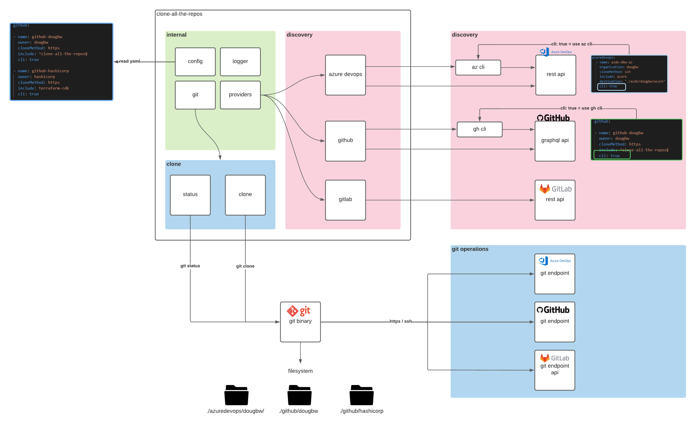

# Introduction

I got fed up spending of having to spend a full 10 minutes cloning all the repos I needed every year or so when I re-installed my machine, so I decided to spend many many hours building a tool to do this for me instead.

`clone-all-the-repos` is a tool written in go which helps organize git repos on your workstation when cloning from Azure DevOps/GitHub/GitLab. It is configuration driven and uses API/CLI tools to discover the remote git repositories, then essentially runs `git clone` in bulk, allowing you to mirror the respective remote system structure regarding organizations, projects, etc.

# Installation

* pre-built binaries can be found on the [releases](https://github.com/dougbw/clone-all-the-repos/releases/) page
* or you can build your own....

bash:
```bash
DOCKER_BUILDKIT=1 docker build --file dockerfile --output bin . -t clone
```
pwsh:
```pwsh
$env:DOCKER_BUILDKIT=1; docker build --file dockerfile --output bin . -t clone
```

# Usage

This tool is configuration driven, so there is only a single command line argument which is the path to the configuration file to be processed. The execution is split into two stages: `discovery` , and `clone`.

## Discovery
The discovery stage can interact with the providers either through API (default) or CLI.

The API discovery method will require an authentication token for the given provider as an environment variable, and the specific details can be found in the [Providers](#Providers) section below.

The CLI discovery method avoids having to handle credentials, but requires the relevant CLI (`az` / `gh`) to be installed and authenticated already. The discovery process will then invoke several CLI commands in order to find everything it needs. This tool will not install or configure the CLI for you, but it will some basic checks on provider startup if the `cli` flag is present.

(`glab` CLI support not implemented *yet*)

## Clone

The final git clone operations are executed using your systems installed `git` binary, so this tool does not attempt to handle the git endpoint credentials in any way - this is intentionally identical to running `git clone <whatever-repo>` on your machine. As such, you may get prompted directly by `git` for things such as ssh host verification checks, ssh key passphrase, username/password, etc during the clone stage.

Using a standalone git library will be explored in the future, although using the existing git installation keeps things simple and leverages existing configuration and credential helpers.

**Example**: 

```sh
clone-all-the-repos repos.yaml
```

**Example configuration file**
```yaml
github:
- name: github-dougbw
  owner: dougbw
  cloneMethod: https
  include: ^clone-all-the-repos$
```

# Requirements

* Remote git repo(s)
* git
* authentication token(s)
* az cli (optional)
* gh cli (optional)

# Providers

Supported providers are listed in the table below.

| Provider | Discovery Method | Environment Variable | Required Scope |
| --- | --- | --- | --- |
| azuredevops | [Rest API](https://docs.microsoft.com/en-us/rest/api/azure/devops/?view=azure-devops-rest-7.1) | `AZDO_PERSONAL_ACCESS_TOKEN` | `Code (Read)` |
| azuredevops | [az cli](https://docs.microsoft.com/en-us/cli/azure/install-azure-cli) | n/a | n/a |
| github | [GraphQL API](https://docs.github.com/en/graphql) | `GITHUB_TOKEN` | `repo` |
| github | [gh cli](https://github.com/cli/cli) | n/a | n/a |
| gitlab | [Rest API](https://docs.gitlab.com/ee/api/) |  `GITLAB_TOKEN` | `read_api` |


## Azure DevOps

Azure DevOps configuration objects are listed within a `azuredevops` key.


| property | type | required | default |  allowed values | description  |
| --- | --- | --- | --- | --- | --- |
| name | string | **true** | - | - | free form string - used in logs to show what is currently being processed |
| organization | string | **true** | - | - | target azure devops organization |
| cloneMethod | string | **true** | - |`https`<br> `ssh` | which `git clone` method to use |
| include | string | false | - |- | regex filter to only return matching projects/repos |
| exclude | string | false  | - | - | regex filter to hide matching projects/repos |
| destination | string | false  | `./azuredevops/{organization}/{project}` | - | local directory path where repos will be cloned in to, relative to the configuration file |
| cli | bool | false| false | `true` <br> `false` | flag to set whether az cli or the rest api is used for discovey process. <br><br>`true`: The `az` cli must be installed and logged in with `az login`. <br><br>`false`: The `AZDO_PERSONAL_ACCESS_TOKEN` environment variable must be set to a valid [personal access token](https://docs.microsoft.com/en-us/azure/devops/organizations/accounts/use-personal-access-tokens-to-authenticate?view=azure-devops&tabs=preview-page) |

Example configuration:
```
azuredevops:
  - name: my-config-name
    organization: myorg
    cloneMethod: ssh
    destination: ./azdo/myorg
```


## GitHub

GitHub configuration objects are listed within a `github` key


| property | type | required | default |  allowed values | description  |
| --- | --- | --- | --- | --- | --- |
| name | string | **true** | - | - | free form string - used in logs to show what is currently being processed |
| owner | string | **true** | - | - | target azure github owner |
| cloneMethod | string | **true** | - |`https`<br> `ssh` | which `git clone` method to use |
| include | string | false | - |- | regex filter to only return matching projects/repos |
| exclude | string | false  | - | - | regex filter to hide matching projects/repos |
| destination | string | false  | `./github/{owner}/` | - | local directory path where repos will be cloned in to, relative to the configuration file |
| cli | bool | false| false | `true` <br> `false` | `true:` the `gh` cli must be installed and logged in (`gh auth login`).<br><br>`false:` env var `GITHUB_TOKEN` must be set to a valid [personal access token](https://docs.github.com/en/authentication/keeping-your-account-and-data-secure/creating-a-personal-access-token)|


Example configuration:
```
github:
- name: github-dougbw
  owner: dougbw
  cloneMethod: https
  include: ^clone-all-the-repos$
  cli: true
```

## GitLab 

GitLab configuration objects are listed within a `gitlab` key. 

This provider is work in progress and has not been tested thoroughly in comparison to the azdo/github implementations (no filtering, pagination not implemented, no `glab` CLI support).

| property | type | required | default |  allowed values | description  |
| --- | --- | --- | --- | --- | --- |
| name | string | **true** | - | - | free form string - used in logs to show what is currently being processed |
| user | string | **true** | - | - | target gitlab user |
| cloneMethod | string | **true** | - |`https`<br> `ssh` | which `git clone` method to use |
| destination | string | false  | `./{group}/{subgroup(s)/{project}` | - | local directory path where repos will be cloned in to, relative to the configuration file |


Example configuration:
```
gitlab:
  - name: gitlab-dougbw1
    user: dougbw
    cloneMethod: https
    destination: "./gitlab/dougbw1"

```

# Solution Design


